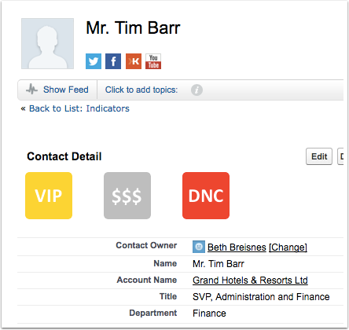

## Get the climate of a constituent at a glance

Weathervane gives users a quick view of key info on a Contact or Account, and it's all admin-configurable with no code required. 

Custom badges called **Indicators** appear active or inactive (grey) on Contacts and/or Accounts. The status of each Indicator is automatically derived from other fields. 

And because it leverages **Custom Metadata Types** for the Indicator definitions, you can set it all up and test to your heart's content in a Sandbox and deploy to Production only when you're ready. No manual re-configuration in Production! Just deploy and go!

Get to know Custom Metadata Types and give your users a hand! Install Weathervane in a Sandbox to start experimenting today.

